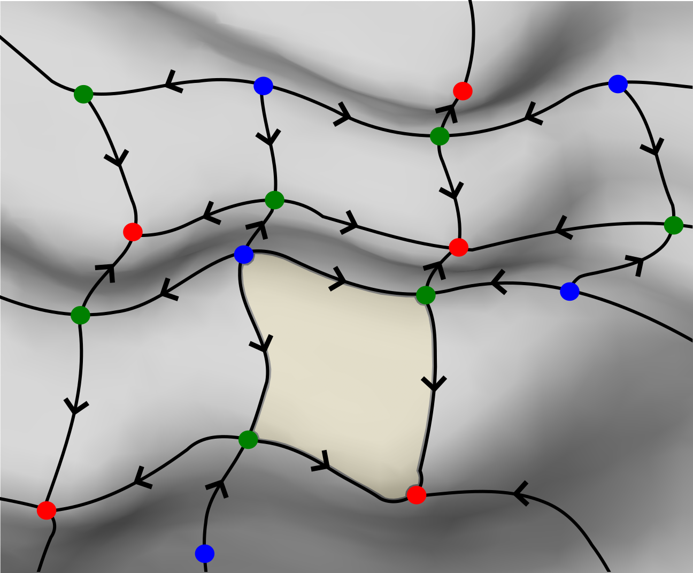
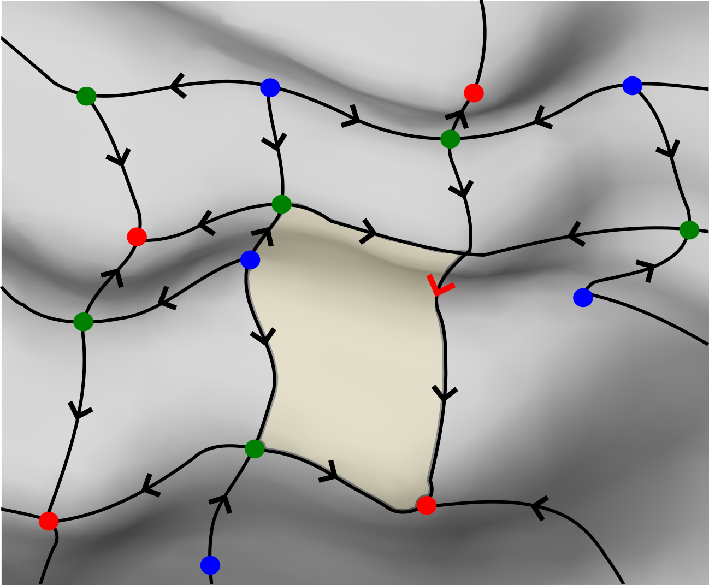
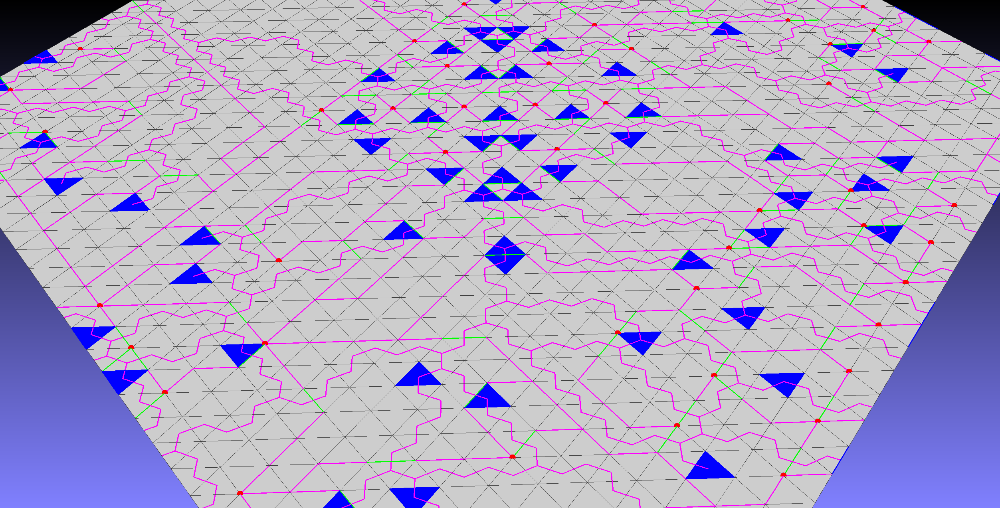

# Morse Theory Mesh Segmentation

Provides a discrete Morse theory framework for 3D mesh data. Work in progress...

# Contents
- [Discrete Morse Theory Introduction](#discrete-morse-theory-introduction)
- [Segmentation Method](#segmentation-method)
- [Dependencies](#dependencies)
- [Usage](#usage)
- [Visualization](#visualization)
# Discrete Morse Theory Introduction

Smooth Morse theory enables to perform topological calculations on a manifold, by just looking at a scalar function (Morse function) on it. Translating this to the discrete case, discrete Morse theory (DMT) aims to do the same on simplicial complexes. While this also works for volumes and higher dimensional data, we are interested in unregular triangular meshes and thereby restrict to 2D surfaces that are embedded in 3D. 

We get a reduced skeleton of the mesh, providing us with topological information, as well as an initial segmentation of the mesh. We can filter out noise from the input scalar function using *persistence* and use the lines of the skeleton to get edges.

<details>
  <summary>More detailed description</summary>

## Setup

Looking at the gradient of the scalar function we get minima, saddle points and maxima, also called critical points, on our surface and we can connect them with lines by following the flow or steepest descent of the gradient. These extremal lines are also called Separatrices and give adjacency information between the critical points.

## Morse-Smale Complex

We get a Morse-Smale complex, which represents the topology of the underlying mesh, by taking the critical points of their respective dimension for the chain groups and the adjacency information as boundary operator. Further the separatrices span a skeleton on the mesh, which leads to separated areas of the mesh enclosed by separatrices. These cells are called Morse cells and give a first segmentation of the mesh.



## Noise Reduction
The initial segmentation usually is very noisy due to the nature of the input data containing a large amount of small local minima and maxima. We are not interested on this small scale structure when looking at segmentations for the whole mesh. Therefore we use a *persistence* [REF]parameter to clean the initial Morse complex from local extrema whose function values are less than the persistence away from the next connected critical simplex. A extremum - saddle point separatrix can be reversed to cancel two critical simplices. This cuts some other separatrices and thereby enlarges Morse cells.




## Edge Detection
In the cancellation process for noise reduction we remove some separatrices and prolong some separatrices. While we can stop the cancellation process such that we preserve the topologically most persistent features, we can also cancel as many critical simplices as possible and reduce the complex to only the minimum number of critical simplices (representing topological features).
When reducing to such a minimal complex, we can store a so called *separatrix persistence* [REF] for each cancelled separatrix. Giving them a meaningful metric, e.g. average curvature value along the separatrix, allows us to threshold out only important separatrices. These than work as an edge detector on the mesh. Using a double threshold for strong and weak edges as in the Canny edge detector, allows to extend the strong, clear edges with some weak edges if they can be prolonged.

</details>

# Segmentation Method
Method described as in our Paper .... \TODO explain


# Dependencies

- Python 3.x (3.9 definitely works, probably also before)
- plyfile (run pip install plyfile or: https://github.com/dranjan/python-plyfile)
 
 # Usage

Everything will be accessed via a **Morse** class. This needs to be imported from:

```python
from src.morse import Morse
```

### 1. Initialize and load data
Initialize the **Morse()** class and load a .ply file (other file not supported right now). The required **quality_index** gives the position/index in the vertex properties where we take our scalar Morse function from and the optional boolean *inverted** can be set to `True` if the input function should be multiplied with -1 (reverses maxima and minima).

```python
data = Morse()
data.load_mesh_ply(filename, quality_index, inverted)
```

<details>
  <summary>More options</summary>

Can also read in a feature vector file (as generated by GigaMesh) and currently takes the maximum value in the vector for each vertex
```python
data.load_new_funvals(filename)
```
</details>

### 2. Morse Complex Computation
Now we can calculate the Morse-Smale complex and reduce it to a persistence level we want:

```python
data.process_lower_stars()
data.extract_morse_complex()
```
calculates the discrete gradient field and extracts the initial Morse-Smale complex from it

```python
data.reduce_morse_complex(persistence)
```
then removes spurious critical points up to a *persistence*.

### 3. Morse Cell Computation
We can get the Morse cells, so the enclosed areas of a Morse Complex at any persistence level:
```python
data.extract_morse_cells(persistence)
```

### 4. Segmentation
We can perform a segmentation for given four parameters
```python
data.Segmentation(persistence, thresh_large, 
                  thresh_small, merge_threshold, 
                  minimum_labels=3)
```
The *minimum_labels* makes sure at least this number of labels is returned (unless the original Morse cells have fewer than that labels)


# Visualization
We offer different ways to visualize what's going on: 
1. Overlay .ply files to be loaded on top of the original mesh.
2. Label .txt files to be imported by GigaMesh.
3. Statistics/ histograms can be saved as images.

The first option are .ply files that contain colored points. Loading the original mesh with e.g. MeshLab and than importing the overlay file, allows to visualize (interim) results by enlarging the point size of the overlay file.

The second option is only suitable for Morse cell or segmentation result visualization, but offers a better looking result in these cases. Therefore the original mesh needs to be loaded in GigaMesh and the according labels .txt file should be imported under **File - Import - Import Labels** (confirm YES when asked whether the vertex is in the first column and choose **Labels-Connected Comp.** on the right to see the results.)

The third option can be opened by any image viewer.

<details>
  <summary>Visualize features</summary>

## Morse Cells / Segmentation Cells

<details>
  <summary>Show</summary>

For the initial Morse Cells or the Morse cells of a reduced Morse Complex visualization can be done with overlay .ply files or label .txt files using one of the following functions: 
```python
data.plot_MorseCells_ply(persistence, filename)
data.plot_morse_cells_label_txt(persistence, filename)
```
where *filename* does not need to contain the file extension.

For segmentation results currently only the labels .txt option is available and a calculated parameter combination can be visulaized by:
```python
data.plot_segmentation_label_txt(persistence, thresh_large, 
                                 thresh_small, merge_threshold, 
                                 filename)
```
</details>

## Morse Complex

<details>
  <summary>Show</summary>

A Morse complex can be visualized by an overlay .ply file as follows:
```python
data.plot_MorseComplex_ply(persistence, filename, 
                           path_color=[255,0,255], 
                           detailed=False, 
                           separate_points_file=False)
```
This returns minima (critical vertices) as red points, saddles (critical edges) as green points in the middle of the edge and maxima (critical faces) as blue points in the center of the face. The separatrix points are by default colored pink, but can be changed using *path_color*.

The options *detailed* and *separate_points_file* refer to plotting options where a more exact and detailed Morse Complex is plotted: Instead of just giving the middle points of edges and faces as colored points, the *detailed* option allows to visualize the critical vertices, edges and faces as red points, green edges and blue triangles, while the separatrix is visualized as paths between the middle points of edges and faces or paths between edges and vertices.
Setting the *separate_points_file* to True additionally writes another .ply file containing only the red critical points, which is required for a better visualization in Meshlab.
The visualization in Meshlab for the detailed Morse complexes is a bit complicated, but you can follow these steps:
1. Load the overlay file first (if the additional points file is there, load both overlay files before the original mesh) It is important, that the overlay files are listed above the original mesh in the project!
2. For the general overlay file now use the following settings:
  - **Points:** Shading - Dot Decorator; Color - Vert; Point Size - (not too small, can be adjusted)
  - **Edges:** Shading - None; Color - Vert; Edge Width - (not too small, can be adjusted)
  - **Face:** Shading - Face; Color - Face; Back Face - Double
3. For the optional points overlay file, use the same settings, but just required for **Points**
4. Now turn on points, edges and faces on the overlay file and optionally the edges on the original mesh file to see the structure. Unfortuantely you can now see the points of each part of the separatrix as well, which does not look pleasant, but turning off the points will hide the red critical vertices. Therefore the additional points overlay can be used, to avoid this: Just turn off the points in the general overlay file and turn on only points in the points overlay file and you will get a good looking complete visualization of the Morse Complex.

This will give you a visualization as here:



</details>

## Edges

<details>
  <summary>Show</summary>

Salient edges can only be visualized as overlay .ply files as well. Using
```python
data.plot_salient_edges_ply(filename, thresh_high, thresh_low = None)
```
gives a .ply file of optionally double thresholded salient edges. If only *thresh_high* is given, it works as if there only is one threshold. All vertices contained in strong edges will be marked as red points, weak edges as blue.
</details>

## Histograms/Statistics

<details>
  <summary>Show</summary>

There are several options to show and/or save images of histograms, persistence diagrams or other statistics. 

A persistence diagram can be obtained as follows
```python
data.plot_persistence_diagram(persistence=0, pointsize=4, 
                             save=False, filepath='persistence_diagram')
```
All parameters are optional, the *persistence* parameter should make all points disappear that are closer than its value to the birth-death line of the persistence diagram.

Persistence Diagram             |  Persistence Diagram with persistence
:-------------------------:|:-------------------------:
 |  

We can get the statistics of the separatrix persistences (includes mean, standard deviation and all values) as well as plot and/or show a histogram of their distribution
```python
statistics = data.salient_edge_statistics(nb_bins=15, log=False, save=False, 
                                          filepath='histogram', show=True)
```
The *log* parameter switches the y-Axis to log scale.

We can also obtain statisctics and histograms from the function values of all vertices or specifically for the vertices making up the critical simplices of a Morse complex with given persistence
```python
statistics1 = data.funval_statistics(nb_bins=15, log=False, save=False, 
                                     filepath='histogram', show=True)
                                     
statistics2 = data.critical_funval_statistics(persistence, nb_bins=15, 
                                              log=False, save=False, 
                                              filepath='histogram', show=True)
```
The *statistics2* returned from the second function here contains separate dictionaries with mean, standard deviation and all the values for minima, saddles and maxima.
</details>

</details>