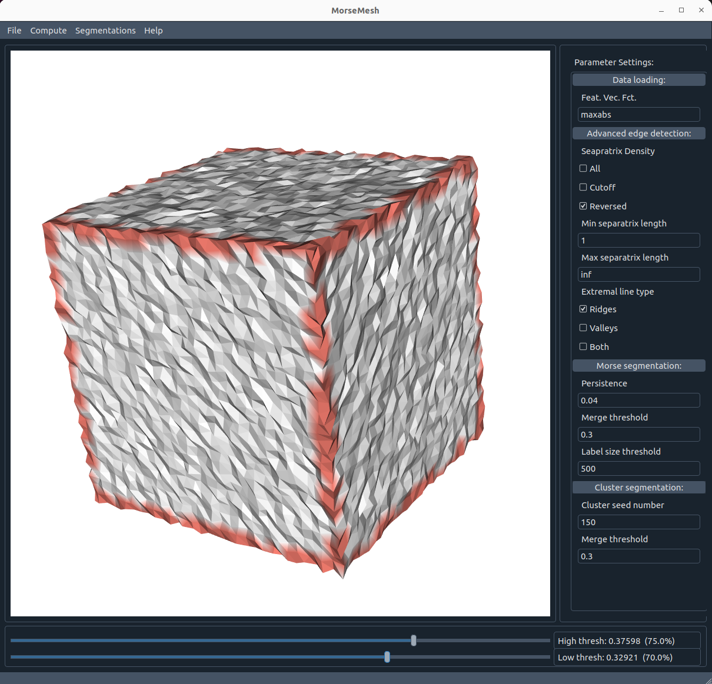
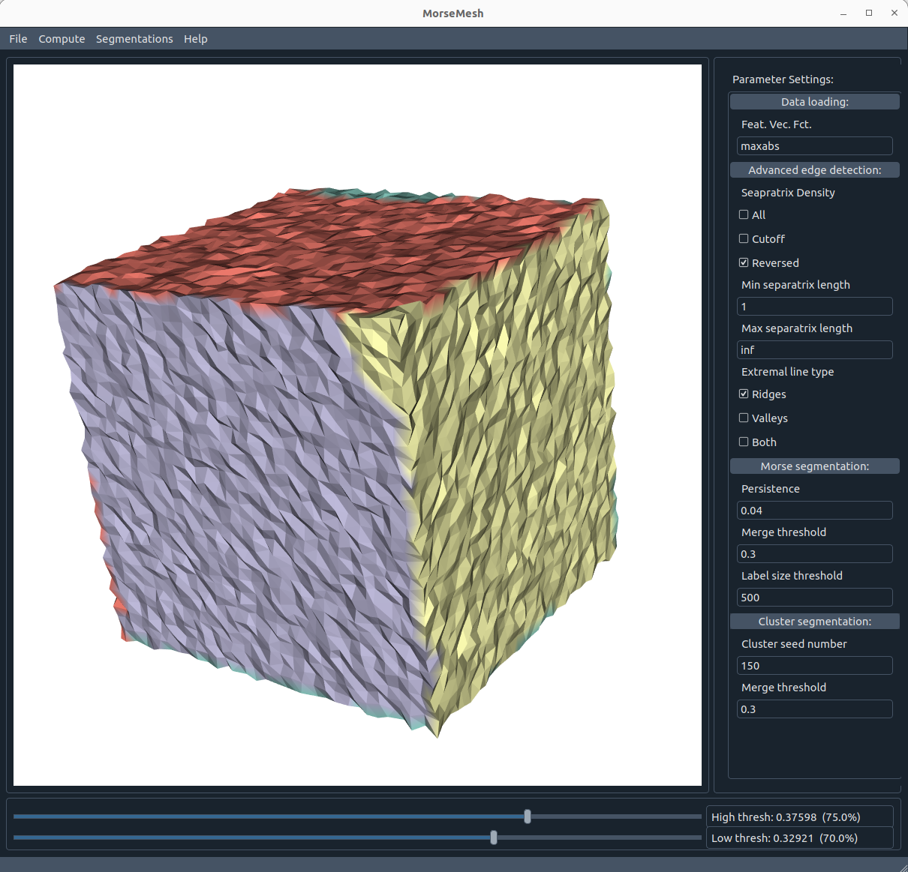

# MorseMesh

This repo provides code for working with discrete Morse theory on meshes. It contains functions for Morse theory based edge detection and segmentation, a cluster based segmentation using the Morse theory based edges as well as a graphical user interface to use the methods.

# Contents
- [Requirements](#requirements)
- [Quick Guide](#quick-guide)
- [Visualization](#visualization)
- [License](#license)
- [Authors](#authors)
- [Contact](#contact)

# Requirements

- Python 3.x (3.9 definitely works, probably also before)
- plyfile (pip install plyfile or: https://github.com/dranjan/python-plyfile)
- pyqt5 
- (Optional) qdarkstyle
- (optional) vtk


# Quick Guide

To start the GUI Tool run:

```
$ python3 gui.py
```


**You need:** A manifold like mesh (ply file) with a scalar function given in the quality 
property of the vertices (e.g. curvature values).

1. Open GUI Tool and  load the mesh under **File** in
2. Press ***Compute Morse complex*** under **Compute**
3. Use sliders to get visually well recognized edges
4. Press ***Morse Segmentation Method*** or ***Cluster Segmentation Method*** 
under **Segmentations**
5. ***Save segmentation (label txt)*** under **File** or re-run with different 
parameters

### **1. Load ply file**

Select *Load ply* under the *File* menu. Note that you need a .ply file that contains 
a function value under **quality**.
Please ensure that your mesh has a manifold-like structure, i.e. especially there 
should be no edges with more than 2 adjacent triangles. Holes or boundaries in the
mesh are no problem algorithmically, but depending on the application it might make 
sense to fill them.
For mesh preprocessing, it is recommended using [GigaMesh](https://gigamesh.eu/).

### **2. Compute Morse Complex**

Compute the Morse complex for a loaded mesh from the *Compute* menu under 
*Compute Morse complex*.

### **3. Determine edges**

You can now use the two sliders in the bottom to determine the edges correctly. Just
move them and the mesh will be updated automatically.

The upper slider determines a **strong threshold** which includes all edges that exceed this 
threshold, while the lower slider determines the **weak threshold**, which adds only edges 
that are below the strong threshold, but above the weak threshold, hence refining 
the result a bit.

Under *advanced edge detection* in the sidebar you can select more edge settings, but the 
only ones that might be interesting though are the "Separatrix density* which could be 
set to *All* or *Reversed* and the *Extremal line type*, which can be switched 
between *ridges* and *valleys*. 



### **4. Segmentation**

Use the **Morse segmentation method** or the **Cluster segmentation method** in the 
*Segmentations* menu. 

You can change the segmentation parameters in the sidebar under *Morse segmentation* 
or *Cluster segmentation*.



### **5. Save result**

You can repeat the segmentation until you get a satisfactory result. The segmentation 
can be saved as a label.txt file in the *File* menu.

# Visualization
There are different ways to visualize the label txt files: 
1. Label .txt files can be visualized in the GUI tool using the **Load labels txt** function from the *File* menu
2. Label .txt files can be visualized in GigaMesh using **File - Import - Import Labels** (confirm YES when asked if the vertex is in the first column and select **Labels-Connected Comp.** on the right to see the results.)

# License

The MorseMesh source code is released under the [GPL License](https://www.gnu.org/licenses/gpl-3.0.de.html)

# Authors

Developed by Jan Philipp Bullenkamp.

Conforming Morse Complexes by Theresa Häberle.

# Contact

Jan Philipp Bullenkamp: jan-philipp.bullenkamp (at) informatik.uni-halle.de
